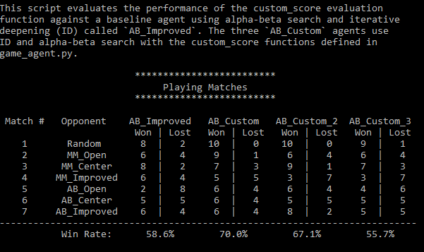

# Custom Score fuctions implented are:

```python
def custom_score(game, player):
    """Calculate the heuristic value of a game state from the point of view
    of the given player.

    This should be the best heuristic function for your project submission.

    Note: this function should be called from within a Player instance as
    `self.score()` -- you should not need to call this function directly.
    Parameters
    game : `isolation.Board`
        An instance of `isolation.Board` encoding the current state of the
        game (e.g., player locations and blocked cells).

    player : object
        A player instance in the current game (i.e., an object corresponding to
        one of the player objects `game.__player_1__` or `game.__player_2__`.)

    Returns
    float
        The heuristic value of the current game state to the specified player.
    """
  
    if game.is_loser(player):
        return float("-inf")

    if game.is_winner(player):
        return float("inf")

    moves_player = len(game.get_legal_moves(player))
    moves_rival = len(game.get_legal_moves(game.get_opponent(player)))
    return float(moves_player/2-2*moves_rival)


def custom_score_2(game, player):
    """Calculate the heuristic value of a game state from the point of view
    of the given player.

    Note: this function should be called from within a Player instance as
    `self.score()` -- you should not need to call this function directly.

    Parameters
    game : `isolation.Board`
        An instance of `isolation.Board` encoding the current state of the
        game (e.g., player locations and blocked cells).

    player : object
        A player instance in the current game (i.e., an object corresponding to
        one of the player objects `game.__player_1__` or `game.__player_2__`.)

    Returns
    float
        The heuristic value of the current game state to the specified player.
    """
   
    if game.is_loser(player):
        return float("-inf")

    if game.is_winner(player):
        return float("inf")

    moves_player = len(game.get_legal_moves(player))
    moves_rival = len(game.get_legal_moves(game.get_opponent(player)))
    return float(-(moves_rival)**2)
def custom_score_3(game, player):
    """Calculate the heuristic value of a game state from the point of view
    of the given player.

    Note: this function should be called from within a Player instance as
    `self.score()` -- you should not need to call this function directly.
    Parameters
    game : `isolation.Board`
        An instance of `isolation.Board` encoding the current state of the
        game (e.g., player locations and blocked cells).

    player : object
        A player instance in the current game (i.e., an object corresponding to
        one of the player objects `game.__player_1__` or `game.__player_2__`.)
    Returns
    float
        The heuristic value of the current game state to the specified player.
    """
    
    if game.is_loser(player):
        return float("-inf")

    if game.is_winner(player):
        return float("inf")

    moves_player = len(game.get_legal_moves(player))
    moves_rival = len(game.get_legal_moves(game.get_opponent(player)))
    return float(moves_player-2*moves_rival) 
```
>custom score and custom score3 are similar to improved score. Where custom score3 is trying to increase moves of given player and reduce 2 fold moves of rival , but in custom score we are increasing moves of given player by 2 fold and reduce rivals moves by 2 fold.
>In custom score2 we are trying to decrease rivals moves exponentially



The win rate from the tournament results are:
AB custom > AB custom2> AB improved > AB custom3

I choose AB custom because:

>1 It has got the highest winning rate of 70%

>2 The winning factor for AB custom is dependent on increase of ones moves and decrease of the rivasl moves, by 2 fold helped to get 70% of win rate.

>3 depth, because moves of rival is considered, its actual depth is one layer deeper than open_score if given the same depth limitation.


